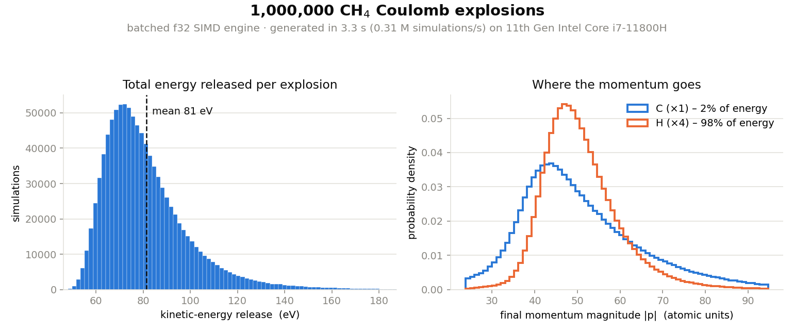

# Coulomb Explosion

A high-performance C++ simulator for Coulomb explosions of small molecules
(2–10 atoms), built to generate large training sets for neural networks that
invert asymptotic momentum measurements back into initial molecular
configurations. The engine is vectorized and cache-friendly: it runs **~0.3 million
independent explosions per second on a single laptop core** (see the demo below).

<br>



- **Left — kinetic-energy release (KER):** the total final kinetic energy per
  explosion (mean ~81 eV).
- **Right — where the momentum goes:** the four light hydrogens carry ~98% of
  the released energy while the heavy carbon carries ~2%, even though momentum
  conservation keeps the fragments' momentum magnitudes comparable.

## Quick demo

To build the SIMD engine, simulate one million CH4 (methane) explosions
from geometries sampled uniformly inside a sphere, and generate the figure above:

```sh
demo/run_demo.sh          # ~15 s total on a laptop (build + 1M sims + plot)
```

> [!NOTE]
>  The molecule structures are intentionally drawn from a synthetic training distribution, not a physical (Wigner/thermal) ensemble. The output of the simulator is a dataset mapping initial geometries to asymptotic momenta per atom.
`python examples/verify_subset.py --bin build/demo-scratch/ch4.bin --n 500`
checks the fast f32 results against a full fp64 `scipy.solve_ivp` oracle (they
agree to ~5e-6). See [demo/README.md](demo/README.md) for details.

## The physics model

The simulator begins from a hypothetical state in which the atoms within a molecule are at rest and have been instantaneously ionized, with the $`i\text{th}`$ atom receiving a charge of $`q_i`$. The simulator assumes a purely Coulombic potential energy surface, resulting in the following ODE system of point charges:

```math
m_i \frac{d^2 \vec{r}_i}{dt^2} = \sum_{j\neq i} \frac{q_i q_j}{|\vec{r}_i - \vec{r}_j|^3}(\vec{r}_i - \vec{r}_j).
```

Here, $`m_i`$ is the mass of the $`i\text{th}`$ atom and $`\vec{r}_i`$ is its time-dependent position vector. The equations are written in atomic units so that the Coulomb constant is equal to 1.

During the simulation, the ions will force each other apart, eventually settling into an asymptotic regime in which the time-dependent momentum vectors, $`\vec{p}_i`$ are very close to their limit $`\lim\limits_{t\to\infty}\vec{p}_i(t)`$.

## Overall goal

The overall goal is to make the simulation code high performance in order to
perform millions of simulations efficiently. The engine is built to be
vectorized and cache-friendly, with correctness and a scalar baseline established
first, then measured, documented optimization.

> Built with Claude Code: I directed the physics, numerical methods, and
> performance strategy; Claude wrote the implementation, including the
> vectorized SIMD (Highway) kernels.

> **Status: working vectorized engine; real dataset generation demonstrated.**
>
> - **Correctness first.** Scalar O(N²) Coulomb baseline, symplectic
>   velocity-Verlet and adaptive RK45 (DP5(4)) integrators, a uniform-sphere
>   sampler, and convergence-driven explosion runs — all validated against the
>   fp64 `scipy.solve_ivp` Python reference in [python/](python/).
> - **Then speed.** A batched SIMD-over-lanes force kernel and lockstep
>   integrator realize **~27–34× over the f64 scalar baseline** at single
>   precision, depending on SIMD width (AVX-512 vs. AVX2 — see
>   [docs/benchmarks/](docs/benchmarks/) and [docs/decisions/](docs/decisions/)).
> - **End to end.** [examples/](examples/) generates a real 10M-simulation CH4
>   dataset (10M sims in 39 s on one AVX2 core), converts it to Parquet, and
>   verifies a subset against the original fp64 oracle
>   ([docs/benchmarks/0008](docs/benchmarks/0008-ch4-dataset-gen.md)).
> - **Still planned.** Promoting Parquet dataset output from example-level into a
>   first-class engine feature, and further integrator optimizations (difficulty
>   binning, refill/wavefront, rsqrt).

## Building

Requires CMake ≥ 3.20, a C++20 compiler, and Ninja. Tests fetch Catch2 at
configure time (needs network on first build).

```sh
cmake --preset release
cmake --build --preset release
ctest --preset release
./build/release/apps/coulomb        # run the demo driver
```

Other presets: `debug` (warnings + ASan/UBSan), `relwithdebinfo` (builds the
Google Benchmark microbenchmarks).

```sh
cmake --preset relwithdebinfo && cmake --build --preset relwithdebinfo
./build/relwithdebinfo/bench/coulomb_bench
```

## Layout

| Path        | Contents                                              |
|-------------|-------------------------------------------------------|
| `include/`  | Public engine headers (`coulomb/…`)                   |
| `src/`      | Engine implementation (`coulomb::engine` library)     |
| `apps/`     | Thin CLI driver                                       |
| `demo/`     | One-command laptop demo + figure (start here)         |
| `examples/` | Production-scale dataset generation (docs/benchmarks/0008) |
| `tests/`    | Catch2 correctness tests                              |
| `bench/`    | Google Benchmark kernels                              |
| `python/`   | Reference implementation + analysis/plotting          |
| `docs/`     | Design decisions and benchmark reports                |

## Design

Algorithm choices (integrators, samplers) are pluggable strategies.
Decisions and performance findings are written up in [docs/](docs/). The Python
reference in [python/](python/) is the correctness ground truth.

## License

[MIT](LICENSE).
