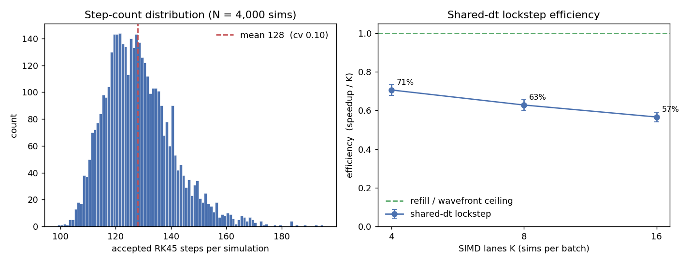

# 0002 — Explosion step-count dispersion and the SIMD-over-lanes decision

- **Date / SHA / machine:** 2026-06-21 · `f68c6b0` · 11th Gen Intel Core
  i7-11800H (Tiger Lake, 8C/16T), L1d 48 KiB/core, L2 1.25 MiB/core, L3 24 MiB
- **Hypothesis:** For the production workload — millions of independent Coulomb
  explosions of a small molecule at random geometries — the SIMD lever is
  batching *whole simulations* across lanes, not vectorizing the force kernel
  over `j` (see the scope note in [0001](0001-force-kernel-baseline.md)). Two
  batching strategies are on the table. This experiment measures the quantity
  that decides between them: how much the adaptive integrator's per-simulation
  step count *varies* across geometries, and what that variation costs a
  lockstep batch.

## The two strategies

Both run one simulation per SIMD lane; they differ in how the adaptive step size
is shared.

- **Shared-dt lockstep (simple).** The whole batch shares one clock and one step
  size — the minimum any lane demands at that moment — and the batch finishes
  only when its slowest lane converges. No per-lane control flow. It pays two
  penalties: the **min-envelope** (every lane is dragged to the step size of
  whichever lane is in its tightest close-encounter) and **straggler idle**
  (lanes that converge early sit masked until the batch ends).
- **Refill / wavefront (complex).** Each lane carries its own clock and step
  size; converged lanes are immediately refilled from a queue. No min-envelope,
  no straggler idle, so the speedup approaches the lane count `K`. The cost is
  divergent control flow, per-lane accept/reject masking, per-lane FSAL state,
  and gather/scatter on refill.

The decision is whether the simple strategy's efficiency is good enough, or
whether the wavefront machinery earns its complexity.

## Method

- Harness: `bench/bench_explosion.cpp` (plain driver, not Google Benchmark —
  this is a statistical study, not a throughput microbenchmark).
- Molecule: the 8-atom mixed-mass example — H, C, N, O (four masses), each singly
  ionized (`q = +1`).
- Sampler: `UniformSphereSampler`, radius `4.0` a.u., minimum separation `0.25`
  a.u., atoms at rest.
- Integrator: adaptive RK45 (DP5(4)), default tolerances `1e-8 / 1e-16`. Driver:
  `run_to_convergence` with the default `pe_stop_fraction = 1e-9` and energy
  redistribution on.
- For each of `M = 4000` sampled configurations the harness records the accepted
  step count and the full step-size-vs-time trace (via the driver's `StepObserver`
  hook).
- **Shared-dt model.** For `K ∈ {4, 8, 16}` it draws 4000 random batches of `K`
  distinct sims and, per batch, replays the merged timeline: at each shared step
  every active lane advances by the minimum demanded step (a lane's demand at
  clock `T` is read from its trace), lanes retire as the clock passes their
  `t_final`, and the batch runs until the last retires. Efficiency is
  `speedup / K` where `speedup = (Σ steps over the K lanes) / (batch SIMD-iterations)`.
- Commands (idle laptop, RelWithDebInfo, GCC 13.3.0, no `-march`):

  ```bash
  cmake --preset relwithdebinfo && cmake --build --preset relwithdebinfo
  ./build/relwithdebinfo/bench/coulomb_explosion --sims 4000 \
      --csv /tmp/explosion_per_sim.csv --eff-csv /tmp/explosion_efficiency.csv
  python/analysis/.venv/bin/python python/analysis/plot_explosion.py \
      --per-sim /tmp/explosion_per_sim.csv --eff /tmp/explosion_efficiency.csv \
      --out docs/benchmarks/0002-explosion-dispersion.png
  ```

## Result



**Per-simulation step count is tight** — mean 128, coefficient of variation only
~0.10:

| metric | min | p50 | mean | p90 | p99 | max | cv |
|--------|-----|-----|------|-----|-----|-----|------|
| accepted RK45 steps | 99 | 126 | 128 | 144 | 166 | 194 | 0.098 |

`corr(min_init_sep, steps) = −0.40`: geometries whose closest pair starts tighter
take more steps (a stronger close-encounter forces smaller steps), but minimum
initial separation explains only ~16% of the variance.

**Shared-dt lockstep efficiency falls well below 1.0 despite the tight
distribution:**

| K (lanes) | efficiency (speedup / K) | implied speedup | lanes refill would recover |
|-----------|--------------------------|-----------------|-----------------------------|
| 4 (AVX2, f64)    | 0.71 | 2.8× | ~1.2 |
| 8 (AVX-512, f64) | 0.63 | 5.0× | ~3.0 |
| 16               | 0.57 | 9.1× | ~6.9 |

## Conclusion

- **The cost is not in the step-count spread.** A 0.10 cv would make lockstep
  nearly free if step *count* were the only thing that varied. It isn't: at
  `K = 8` the batch takes ~204 SIMD-iterations to clear ~1024 steps of work,
  while the slowest single lane is only ~150 steps. Straggler idle accounts for
  the drop from 8 to ~6.8 effective lanes; the **min-envelope accounts for the
  larger drop**, 6.8 → 5.0. The penalty comes from small-step phases *not
  aligning* across geometries — an effect invisible in the cv, which is exactly
  why it needed measuring.
- **Shared-dt lockstep is a strong first cut.** Even at `K = 8` it delivers a 5×
  speedup over scalar. Build this first; it needs no divergent control flow.
- **Refill is worth it for wide SIMD.** At `K = 8` the wavefront recovers ~3 of
  8 lanes (63% → ~100%), and ~7 of 16 at `K = 16`. On an AVX-512 target that is
  a large fraction of the throughput, so the wavefront complexity is justified
  once the simple path is in place and profiled.
- **Difficulty binning is a cheap middle path.** Grouping sims by minimum initial
  separation (corr −0.40) before batching would recover part of the min-envelope
  loss without per-lane clocks. Worth measuring as a variant before committing to
  the full wavefront.

**Caveat on the model.** Shared-dt efficiency is estimated from each sim's
*unforced* trace — a lane forced to step smaller than it wanted is assumed to
demand the same step size at a given clock time. That holds to first order (the
demanded step is set by the local dynamics, which sub-stepping does not change),
so these figures are a sound ceiling estimate, not a cycle-accurate result. The
real batched integrator will confirm them.

## Follow-ups

- Implement the shared-dt lockstep batch (Highway, one sim per lane) and measure
  realized speedup against this estimate and against the scalar per-sim baseline.
- Add a difficulty-binned variant (sort by `min_init_sep`) and re-measure the
  shared-dt efficiency to size what binning alone buys.
- If the wavefront is pursued, this report's efficiency gap is its justification;
  measure realized efficiency including step-rejection and refill overhead.
- Repeat on the HPC target node (different ISA width) — the efficiency-vs-K curve
  is the portable artifact to re-measure there.
