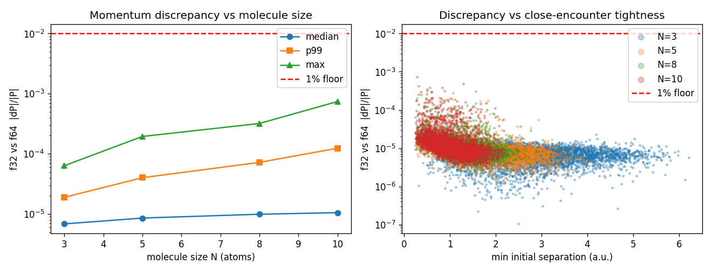

# 0004 — Single-precision robustness: can the data generator run in f32?

- **Date / SHA / machine:** 2026-06-22 · `e039b51` · 11th Gen Intel Core
  i7-11800H (Tiger Lake, 8C/16T), L1d 48 KiB/core, L2 1.25 MiB/core, L3 24 MiB
- **Hypothesis:** The reconstruction model runs fp32 on GPUs and the
  experimental momentum resolution is ~1%, so the **data generator** may be able
  to run in `float` for the throughput win (f32 doubles the SIMD lane count —
  K=8→16 on this AVX-512 target — on top of the batched kernel from [0003](0003-batched-force-kernel.md)).
  The risk is specific to this problem: the explosion starts from near-singular
  1/r² forces, and the close-encounter tail ([0002](0002-explosion-dispersion.md)'s
  tight-`min_init_sep` subpopulation) both amplifies round-off and can break the
  adaptive controller. This experiment measures, against the 1% floor, whether
  f32 (a) *fails* and (b) shifts the asymptotic momenta — across molecule sizes,
  since close-encounter density grows with N at fixed sampling radius.

## Scope and framing

Two precision decisions are independent and only one is tested here. "Model is
fp32" forces only that the *stored* features be fp32 (a free final cast). Running
the *integration* in f32 is a separate, throughput-motivated choice — that is what
this report evaluates. The decision is kept reversible by design: precision is a
compile-time switch (`COULOMB_SINGLE_PRECISION`, the `relwithdebinfo-f32` preset)
with **f64 as the default**, so f64 remains the reference and a production
fallback; this is not a commitment to single precision.

The bar is the ~1% experimental momentum resolution, not f64 fidelity. f32 is
"good enough" if its discrepancy from f64 stays comfortably under 1% and it does
not inject a systematic (learnable) bias.

## Method

- Harness: `bench/bench_precision_sweep.cpp` (plain driver). It is
  precision-agnostic (uses the build's `Real`); built twice — `relwithdebinfo`
  (f64) and `relwithdebinfo-f32` (f32) — and run on **one shared geometry file**
  so both precisions see identical inputs (the f32 run reads the f64-dumped
  positions and rounds them to float on load, which is the correct start of the
  f32 pipeline).
- Molecule: N atoms built by cycling H, C, N, O (the 0002 chemistry), each singly
  ionized. Sizes swept: **N ∈ {3, 5, 8, 10}**.
- Sampler: `UniformSphereSampler`, radius 4.0 a.u., `min_separation = 0.25` a.u.,
  atoms at rest. M = 4000 geometries per size.
- Integrator: adaptive RK45 (DP5(4)); driver `run_to_convergence` with energy
  redistribution. Each f32 run is wrapped to record a failure code
  (exception / not-converged / non-finite momenta).
- **Tolerances.** There is no automatic precision scaling — tolerances are CLI
  parameters. The f64 run used the engine defaults (`rtol 1e-8`, `atol 1e-16`,
  `pe_stop 1e-9`); the f32 run used a single hand-picked fp32-safe point
  (`rtol 1e-4`, `atol 1e-7`, `pe_stop 1e-5`), each raised to sit at/above fp32 ε
  (≈1.2e-7), since all three f64 defaults are below or near ε and are meaningless
  in float. This is a reasoned point, **not a tuned sub-sweep** (see Caveats).
- Metric: config-norm relative momentum error `|ΔP|/|P|` over the whole
  N-fragment momentum vector (decision-relevant — reconstruction uses all
  fragments jointly, and the config norm does not blow up on near-zero heavy-atom
  momenta), plus the per-atom worst and the signed bias. Diff and plot:
  `python/analysis/plot_precision.py`.
- Commands (idle laptop, RelWithDebInfo, GCC 13.3.0, no `-march`):

  ```bash
  cmake --preset relwithdebinfo     && cmake --build --preset relwithdebinfo     --target coulomb_precision_sweep
  cmake --preset relwithdebinfo-f32 && cmake --build --preset relwithdebinfo-f32 --target coulomb_precision_sweep
  for N in 3 5 8 10; do
    ./build/relwithdebinfo/bench/coulomb_precision_sweep --atoms $N --sims 4000 \
        --dump-geometries /tmp/geo_n${N}.txt --csv /tmp/prec_n${N}_f64.csv
    ./build/relwithdebinfo-f32/bench/coulomb_precision_sweep --atoms $N \
        --geometries /tmp/geo_n${N}.txt --rtol 1e-4 --atol 1e-7 --pe-stop 1e-5 \
        --csv /tmp/prec_n${N}_f32.csv
  done
  python/analysis/.venv/bin/python python/analysis/plot_precision.py --sizes 3,5,8,10 \
      --f64 /tmp/prec_n{n}_f64.csv --f32 /tmp/prec_n{n}_f32.csv \
      --summary-csv docs/benchmarks/0004-precision-sweep.csv \
      --out docs/benchmarks/0004-precision-sweep.png
  ```

- Committed evidence: [`0004-precision-sweep.csv`](0004-precision-sweep.csv) (summary)
  and [`0004-precision-sweep.png`](0004-precision-sweep.png) (the figure below).

## Result



Config-norm `|ΔP|/|P|`, f32 vs f64 on identical geometries (4000 sims/size):

| N  | f32 failures | median  | p99     | max         | bias    | geometries > 1% |
|----|--------------|---------|---------|-------------|---------|-----------------|
| 3  | 0 %          | 6.8e-6  | 1.9e-5  | 6.4e-5      | +1.8e-10 | 0              |
| 5  | 0 %          | 8.6e-6  | 4.0e-5  | 2.0e-4      | −2.3e-10 | 0              |
| 8  | 0 %          | 9.9e-6  | 7.2e-5  | 3.2e-4      | +1.2e-11 | 0              |
| 10 | 0 %          | 1.1e-5  | 1.2e-4  | **7.4e-4**  | +1.4e-10 | 0              |

## Conclusion

- **f32 is robust: zero failures across all 16,000 runs** — no NaN/Inf, no
  step-rejection death, no step-cap. A naive concern that sub-ε tolerances would
  break convergence did not materialize: the explosion converges via `pe_stop`
  out where the dynamics are trivial, before the round-off floor becomes binding.
- **The worst geometry anywhere is ~7e-4 — about 13× below the 1% floor**; the
  median is ~1000× below. Not one of 16,000 geometries exceeds 1% at any size.
- **The discrepancy grows with N exactly as the close-encounter mechanism
  predicts** (right panel: error rises as `min_init_sep` approaches the sampler's
  0.25 floor, and N=10 occupies that tight-separation corner) — but gently, and
  it stays well under the bar. There is **no over-floor tail to filter**, so the
  f32/f64-fallback hybrid is unnecessary at these sizes.
- **Bias is ~1e-10 — pure zero-mean noise, no systematic shift.** The benign
  case: nothing for the model to learn as a spurious artifact.
- **Verdict: f32 data generation is justified** — robust and ~13× inside the
  accuracy budget at the production size. This clears the way for the f32
  throughput path (2× SIMD lanes), while the compile-time switch keeps f64 as the
  default reference/fallback rather than committing the engine to float.

## Caveats

- **Single tolerance point, not tuned.** The f32 tolerances are one reasoned
  fp32-safe setting, not the result of a sub-sweep. The smoke test incidentally
  showed f32 also runs cleanly at the *tight* f64 defaults, with a *smaller*
  discrepancy (it tracks f64 more closely) — so the loosening is a throughput
  choice (looser ⇒ fewer steps), and the loose values reported here are the
  **conservative** setting for the accuracy claim. Tightening only improves the
  margin.
- **Conditioned on `min_separation = 0.25` a.u.** A tighter sampling floor (or
  near-equilibrium geometries with closer bonded pairs) would push the
  close-encounter tail up; re-measure if the production distribution changes.
- **This measures the engine's f32-vs-f64 trajectories**, not an end-to-end
  reconstruction. The planned NN-guess + differentiable-ODE-refinement path only
  *loosens* the data-precision requirement (the NN needs a basin-landing guess,
  the refiner does the precise inversion), so this is a conservative bound on
  what f32 data costs the downstream task.

## Follow-ups

- **f32 tolerance sub-sweep** (`rtol ∈ {1e-3, 1e-4, 1e-5}`): find the loosest
  tolerance that stays under the floor, to maximize the step-count (throughput)
  win without crossing 1%.
- **Stress the tail:** re-run at smaller `min_separation` and larger N to locate
  where f32 finally crosses the floor — the portable artifact is the
  `max |ΔP|/|P|` vs (N, min_sep) surface.
- **End-to-end check:** train the reconstruction model on f32- vs f64-generated
  data, compare accuracy on a common test set — the definitive proof, for which
  this report's margin is the prior that it will pass.
- **Wire f32 into the batched kernel** (0003's `ScalableTag<float>`, K=16) and
  re-measure realized throughput now that f32 accuracy is cleared.
