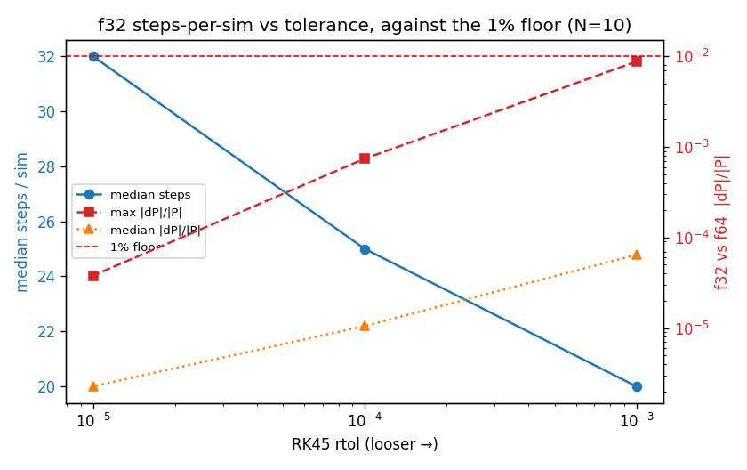

# 0005 — f32 batched kernel: realized throughput and the steps/tolerance lever

- **Date / SHA / machine:** 2026-06-23 · `588e28b` · 11th Gen Intel Core
  i7-11800H (Tiger Lake, 8C/16T, AVX-512), L1d 48 KiB/core, L2 1.25 MiB/core,
  L3 24 MiB
- **Hypothesis:** [0004](0004-precision-sweep.md) cleared f32 on accuracy (robust,
  ~13× inside the 1% momentum floor at N=10) and [0003](0003-batched-force-kernel.md)
  showed the f64 batched kernel captures only ~2.5× of its 8 lanes because it is
  ~71% divide/sqrt-port-bound. f32 doubles the lane count (K=8→16 on this
  AVX-512 target). The open question: **does f32 buy more than the 2× the lane
  doubling promises**, since the divide/sqrt port — the binding constraint — does
  not scale with width the way FMA does, and f32 `vsqrtps`/`vdivps` are cheaper
  per element than their f64 counterparts? And separately, how much does f32's
  accuracy headroom let us **loosen RK45 tolerance to cut steps per sim**?

## Scope and framing

There is no batched *integrator* yet (0003's second follow-up, a much larger
build). Realized end-to-end throughput ≈ **(per-step force-kernel lane speedup) ÷
(steps per sim)**, so this report measures the two multiplicands independently —
Part A (the force kernel) and Part B (steps vs tolerance) — and reports their
**product as a projection**. True realized throughput, with the straggler /
min-envelope penalties quantified in [0002](0002-explosion-dispersion.md), awaits
the batched integrator; this projection is the prior for it.

As in 0004, precision stays a compile-time switch (`COULOMB_SINGLE_PRECISION`,
the `relwithdebinfo-f32` preset) with **f64 the default** — this is a throughput
measurement, not a commitment to single precision.

## Part A — f32 force-kernel ceiling

### Method

- Harness: `bench/bench_force_batch.cpp`, extending 0003. The batched kernel is
  self-contained Highway code (independent of the engine's compile-time `Real`),
  so it is templated on element type `T` and **f32 (K=16) and f64 (K=8) kernels
  coexist in one binary** — no separate f32 preset needed. Built with
  `-march=native` (AVX-512) under `relwithdebinfo`; GCC 13.3.0.
- Benchmarks, all on N = 2–10, items = K·N·N per iteration:
  - `BM_ForceScalarBatch` — K independent scalar f64 evaluations (the absolute
    reference; stays f64, since the engine's scalar kernel uses compile-time
    `Real`).
  - `BM_ForceBatched<double>` / `<float>` — the production batched kernel
    (`1/sqrt`, not rsqrt, so numerics match the scalar baseline).
  - `BM_ForceBatchedNoDivSqrt<double>` / `<float>` — port-bound diagnostic:
    identical data flow with the per-pair `1/sqrt` + two divides replaced by
    multiplies. Non-physical; the divide/sqrt-free floor.
- **Correctness gate** (runs once before timing, aborts otherwise): f32-batched
  matches f64-batched on shared geometry to **max relative 4.1e-07** — f32
  precision, consistent with 0004 and 0003's 1.4e-14 f64-vs-scalar check.
- Capture: 15 repetitions, `--benchmark_report_aggregates_only`, **pinned to one
  core** (`taskset -c 3`). Pinning collapses the right-skew that single-digit-ns
  rows pick up from scheduling / AVX-512 frequency jitter: **cv ≤ 2% for all
  production sizes (N≥6)**, matching 0003. Small N (2–4) stays noisy (times are a
  few ns) and is not production-relevant. Numbers below are the **median** of 15.

  ```bash
  cmake --preset relwithdebinfo && cmake --build --preset relwithdebinfo --target coulomb_force_batch
  taskset -c 3 ./build/relwithdebinfo/bench/coulomb_force_batch \
      --benchmark_repetitions=15 --benchmark_report_aggregates_only=true \
      --benchmark_out=docs/benchmarks/0005-f32-throughput.json \
      --benchmark_out_format=json
  ```

- Raw evidence: [`0005-f32-throughput.json`](0005-f32-throughput.json).

### Result

Median real-time per call (ns) and throughput ratios. "32/64" is the headline
(f32-batched ÷ f64-batched items/sec); "32/scalar" is the absolute win over
0001's scalar floor; "nodivsqrt 32/64" is the divide/sqrt-free control.

| N  | scalar (ns) | batched f64 (ns) | batched f32 (ns) | **32/64** | 32/scalar | nodivsqrt 32/64 |
|----|-------------|------------------|------------------|-----------|-----------|-----------------|
| 2  | 87.9        | 20.9             | 17.8             | 2.35      | 9.90      | 2.50            |
| 3  | 154.9       | 45.2             | 33.5             | 2.70      | 9.25      | 2.00            |
| 4  | 259.8       | 89.3             | 62.1             | 2.87      | 8.36      | 2.05            |
| 5  | 407.1       | 149.9            | 99.3             | 3.02      | 8.20      | 2.04            |
| 6  | 593.9       | 228.8            | 149.0            | 3.08      | 7.99      | 2.01            |
| 7  | 796.8       | 318.2            | 203.2            | 3.13      | 7.84      | 1.98            |
| 8  | 1054.2      | 424.0            | 267.8            | 3.17      | 7.87      | 1.97            |
| 9  | 1310.5      | 544.6            | 341.8            | 3.19      | 7.67      | 1.99            |
| 10 | 1629.3      | 677.7            | 422.9            | **3.21**  | 7.71      | 2.00            |

**f32 buys ~3.2× over f64 at production size — well beyond the 2× the doubled
lane count alone promises.** The control nails the mechanism: the divide/sqrt-free
kernel sits at **exactly ~2.0× across all N** (pure lane doubling, since with no
divide/sqrt port traffic f32's only advantage is the extra lanes). The real
kernel's *excess* over that — 3.21× vs 2.00× at N=10 — is precisely f32's cheaper
`vsqrtps`/`vdivps`, exactly the headroom 0003's 71%-divide/sqrt-bound measurement
predicted. The two benchmarks bracket the answer: the ratio climbs with N (2.35×
→ 3.21×) as the divide/sqrt-bound pair loop grows relative to the fixed
per-call overhead. Absolute win over the scalar floor: **~7.7× at N=10.**

## Part B — tolerance → steps per sim

### Method

- Harness: `bench/bench_precision_sweep.cpp` (0004), unchanged — it already emits
  a `steps` column per geometry. Built generic (no `-march`) under
  `relwithdebinfo-f32`; the f64 reference under `relwithdebinfo`.
- N = 10, M = 4000 geometries, `UniformSphereSampler` radius 4.0 a.u.,
  `min_separation = 0.25` a.u. (the 0004 setup). **f64 reference** runs the engine
  defaults (`rtol 1e-8`, `pe_stop 1e-9`) and dumps the geometries; the three
  **f32** runs read the *same* geometries and sweep **`rtol ∈ {1e-3, 1e-4, 1e-5}`**,
  holding `atol 1e-7` / `pe_stop 1e-5` fixed at 0004's fp32-safe point. Holding
  atol/pe_stop fixed isolates the rtol→steps tradeoff, and the **`rtol 1e-4` row
  reproduces 0004's N=10 point exactly** (max 7.4e-4) — a built-in wiring check.
- Metric: median `steps` (the throughput multiplicand) and the config-norm
  `|ΔP|/|P|` vs f64 (the cost), against 0004's 1% floor. Aggregated by a new
  Part-B reader `python/analysis/plot_steps_vs_rtol.py`, which reuses
  `plot_precision.py`'s discrepancy formula and floor.

  ```bash
  cmake --preset relwithdebinfo-f32 && cmake --build --preset relwithdebinfo-f32 --target coulomb_precision_sweep
  ./build/relwithdebinfo/bench/coulomb_precision_sweep --atoms 10 --sims 4000 \
      --dump-geometries /tmp/geo_n10.txt --csv /tmp/prec_n10_f64.csv
  for RTOL in 1e-3 1e-4 1e-5; do
    ./build/relwithdebinfo-f32/bench/coulomb_precision_sweep --atoms 10 \
        --geometries /tmp/geo_n10.txt --rtol $RTOL --atol 1e-7 --pe-stop 1e-5 \
        --csv /tmp/prec_n10_f32_rtol${RTOL}.csv
  done
  python/analysis/.venv/bin/python python/analysis/plot_steps_vs_rtol.py \
      --f64 /tmp/prec_n10_f64.csv \
      --f32 /tmp/prec_n10_f32_rtol1e-3.csv /tmp/prec_n10_f32_rtol1e-4.csv /tmp/prec_n10_f32_rtol1e-5.csv \
      --summary-csv docs/benchmarks/0005-f32-throughput.csv \
      --out docs/benchmarks/0005-f32-throughput.png
  ```

- Evidence: [`0005-f32-throughput.csv`](0005-f32-throughput.csv) and the figure
  below. (The f64 default reference runs **124** median steps at these geometries.)

### Result



| rtol | median steps | f32 failures | median \|ΔP\|/\|P\| | p99 | max | geometries > 1% |
|------|--------------|--------------|---------------------|-----|-----|-----------------|
| 1e-3 | **20**       | 0 %          | 6.4e-5              | 1.8e-3 | **8.8e-3** | 0 |
| 1e-4 | 25           | 0 %          | 1.1e-5              | 1.2e-4 | 7.4e-4     | 0 |
| 1e-5 | 32           | 0 %          | 2.3e-6              | 1.0e-5 | 3.8e-5     | 0 |

Zero failures everywhere. **Strictly, the loosest rtol that holds the floor is
1e-3** — zero of 4000 geometries exceed 1%. But its worst geometry sits at 0.87%,
only ~1.1× under the bar, and 0004 flagged that a tighter sampling
`min_separation` would push that close-encounter tail up. **`rtol 1e-4` is the
defensible operating point**: ~13× margin (max 7.4e-4) for only 25% more steps
(25 vs 20). Tightening to 1e-5 buys a ~260× margin at 32 steps. The knob is a
direct steps-vs-margin trade with no failure risk in this range.

## Projection

Per-step force-kernel speedup (Part A, N=10: **3.21×**) × step reduction vs the
f64 default config (124 median steps → the f32 path):

| f32 path | steps | step reduction | × Part A 3.21× | floor margin |
|----------|-------|----------------|----------------|--------------|
| rtol 1e-4 (recommended) | 25 | 5.0× | **~16×** | ~13× |
| rtol 1e-3 (aggressive)  | 20 | 6.2× | ~20×           | ~1.1× (thin) |

**Projected ~16× sims/sec over the f64 default** at the recommended tolerance
(~20× if the thin-margin rtol 1e-3 is later justified). **This is a projection,
not a realized number:** it assumes per-step cost is dominated by the force
kernel (RK45 does 6–7 force evals/step plus integrator overhead), and it folds
together three changes the production f32 path makes at once — f32 arithmetic,
looser rtol, and looser pe_stop. The batched integrator will measure the real
figure, against this prior.

## Conclusion

- **f32 clears the bar the lane count set and then some: ~3.2× over f64 batched
  at N=10**, vs the ~2.0× pure-lane-doubling control — the surplus is f32's
  cheaper divide/sqrt, exactly where 0003 said the f64 kernel was bound. The f32
  kernel is correct to f32 precision (gate: 4.1e-7).
- **Loosening tolerance is a clean, failure-free steps lever:** 20–32 steps
  across rtol 1e-3→1e-5, all comfortably inside the floor; rtol 1e-4 is the
  recommended point (~13× margin, 25 steps).
- **Projected ~16× sims/sec over the f64 default**, labeled a projection pending
  the batched integrator.

## Caveats

- **No batched integrator** — the projection's central caveat (see Scope). It
  treats the force kernel as the per-step proxy and combines per-step and
  per-sim wins multiplicatively.
- **Part A small-N noise.** N = 2–4 run at single-digit ns and remain jittery
  even pinned; the production-relevant N≥6 rows are cv ≤ 2%.
- **Part B inherits 0004's conditioning.** Results hold at `min_separation =
  0.25` a.u.; a tighter sampling floor or closer bonded pairs would raise the
  close-encounter tail and could erode the (already thin) rtol 1e-3 margin first.
- **Part A is `-march=native` (AVX-512); Part B is generic** (matching 0004's
  precision-agnostic build). The lane counts (K=8/16) are specific to this
  AVX-512 target; a narrower ISA changes the absolute lane speedup but not the
  divide/sqrt-economics story.

## Follow-ups

- **rsqrt + Newton–Raphson** (0003 follow-up #1): f32 makes `vrsqrt14ps` *more*
  attractive — it would attack the same divide/sqrt port this report shows is the
  binding constraint. A separate axis; the synergy is noted, not built here.
- **Batched integrator** (0003 follow-up #2): the true realized end-to-end, for
  which this report's ~16× is the prior. Will pay 0002's straggler / min-envelope
  penalties the per-step projection omits.
- **Precision policy ADR:** with 0004 (accuracy) and 0005 (throughput) both in,
  the decision to adopt f32 as the production data-generation default is ready to
  record in `docs/decisions/`.
