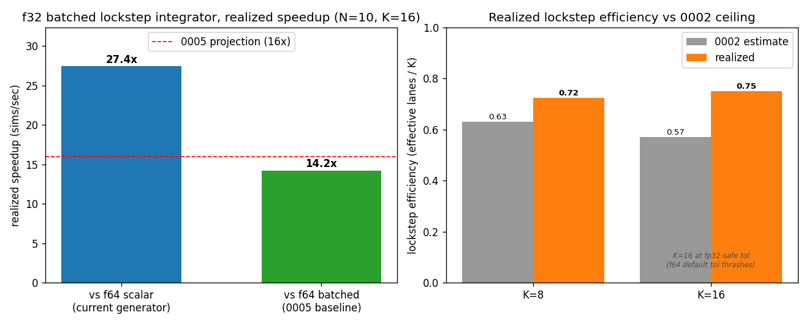

# 0006 — Batched lockstep RK45 integrator: realized throughput

- **Date / SHA / machine:** 2026-06-23 · `28499fc` · 11th Gen Intel Core
  i7-11800H (Tiger Lake, 8C/16T, AVX-512), L1d 48 KiB/core, L2 1.25 MiB/core,
  L3 24 MiB
- **Hypothesis:** [0005](0005-f32-throughput.md) *projected* ~16× sims/sec for an
  f32 batched data generator by multiplying a per-step force-kernel speedup
  (3.21×) by a step-count reduction (~5×), explicitly deferring the realized
  number to a batched integrator that does not yet exist. [0002](0002-explosion-dispersion.md)
  *estimated*, from step-count dispersion, that shared-dt lockstep would capture
  only 0.63 (K=8) / 0.57 (K=16) of the lane count — but from *unforced* traces,
  leaving step-rejection overhead unmeasured. This experiment builds the simplest
  batched integrator (shared-dt lockstep, no refill) and measures both: the
  realized speedup against 0005's projection, and the realized lockstep efficiency
  against 0002's ceiling.

## Scope and framing

This is the **simple first cut** 0002 recommended building first: **shared-dt
lockstep, no refill.** The whole batch advances with one step size set by the
tightest still-active lane (the min-envelope); a lane that meets its `pe_stop` is
latched and dropped from the error norm but its slot is not refilled, so the batch
runs until the last lane converges (straggler idle). This deliberately leaves the
refill/wavefront recovery (0002's 0.63→~1.0 at K=8) on the table — that is the
named next step. What this captures is the realized end-to-end number the 0005
projection was a prior for, and the first cycle-accurate lockstep efficiency
(including step-rejection, which 0002's model omitted).

## Method

- **Integrator** (`include/coulomb/batched_integrator.hpp`): a templated batched
  DP5(4) mirroring the scalar `DormandPrince45` (`src/integrators.cpp`)
  lane-for-lane — same Butcher tableau, FSAL, RMS error norm
  (`scale = atol + rtol·max(|y_old|,|y_new|)`), and step controller — with three
  changes for lockstep: per-lane error reduced to the **worst active lane** for
  one shared accept/reject; converged lanes **masked out** of that reduction (no
  refill); per-lane finalize (energy redistribution + momenta). Built on the
  shared SIMD force kernel (`include/coulomb/batched_force.hpp`, with a per-lane
  potential-energy kernel added for the termination check).
- **Harness** (`bench/bench_batched_integrator.cpp`, `-march=native`): a
  correctness gate plus the measurement, both against the scalar
  `run_to_convergence` on **identical geometries** (the per-lane oracle).
- **Molecule / geometries:** N=10, H-C-N-O cycle (the 0002/0004 chemistry),
  `UniformSphereSampler` r=4.0, `min_separation=0.25` a.u.; pool of 8192 sims.
- **Two operating points:** the f64 **default** (`rtol 1e-8`, `pe_stop 1e-9` —
  the 0005 baseline) and the f32 **production** point (`rtol 1e-4`, `atol 1e-7`,
  `pe_stop 1e-5` — the ADR [0004](../decisions/0004-precision-policy.md) setting).
- **Metrics.** (1) Lockstep efficiency = `Σ(scalar steps) / (K · Σ(batch
  SIMD-iters))`, ISA-independent, comparable to 0002. (2) Wall-time throughput
  (sims/sec), end-to-end convergence runs timed with 15 repetitions, median
  reported (cv ≤ 1.5% except the f32 production row at 2.4% — it is the fastest,
  hence shortest, run). Pinned to one core (`taskset -c 3`), idle machine, GCC
  13.3.0.
- Commands:

  ```bash
  cmake --preset relwithdebinfo && cmake --build --preset relwithdebinfo --target coulomb_batched_integrator
  taskset -c 3 ./build/relwithdebinfo/bench/coulomb_batched_integrator \
      --atoms 10 --batches 512 --reps 15 --csv docs/benchmarks/0006-batched-integrator.csv
  python/analysis/.venv/bin/python python/analysis/plot_batched_integrator.py \
      --csv docs/benchmarks/0006-batched-integrator.csv --out docs/benchmarks/0006-batched-integrator.png
  ```

- Evidence: [`0006-batched-integrator.csv`](0006-batched-integrator.csv) and the
  figure below.

## Result

**Correctness.** Batched per-lane asymptotic momenta match the scalar oracle to
**max |ΔP|/|P| = 5.0e-09** at rtol 1e-8 (both are tolerance-1e-8 solutions; their
lockstep-vs-independent step sequences agree to ~rtol), all lanes converged.



Throughput and efficiency (N=10, pool 8192, 15 reps):

| run | K | sims/sec | cv | lockstep eff | mean batch steps |
|-----|---|----------|------|--------------|------------------|
| scalar f64 default  | 1  | 4 059   | 1.1 % | —     | 126.8 |
| scalar f64 prod     | 1  | 19 846  | 1.3 % | —     | 25.5  |
| batched f64 default | 8  | 7 820   | 0.4 % | 0.724 | 175.2 |
| batched f64 prod    | 8  | 43 512  | 1.2 % | 0.812 | 31.4  |
| batched f32 default | 16 | 5 660   | 0.4 % | 0.216 | 586.4 |
| batched f32 prod    | 16 | **111 365** | 2.4 % | 0.751 | 34.0 |

Realized speedup of the f32 production path (K=16):

| baseline | speedup |
|----------|---------|
| f64 **batched** default (apples-to-apples; 0005's per-step ratio implies a batched baseline) | **14.2×** |
| f64 **scalar** default (the actual current generator) | **27.4×** |

## Conclusion

- **0005's ~16× projection is validated.** The apples-to-apples realized number —
  f32 batched (prod) ÷ f64 batched (default) — is **14.2×**, ~11% under the 16×
  projection. The gap decomposes cleanly: realized step reduction 5.6× (matches
  the projected ~5×), but the realized per-step f32 integrator gain is 2.6× vs the
  3.2× bare-force-kernel ratio 0005 used. That shortfall is exactly what the
  projection omitted: f32 K=16's lower lockstep efficiency (0.75 vs f64 K=8's 0.81
  at the prod point) plus the integrator's non-force overhead (7 stages, error
  norm, finalize) that does not enjoy the full force-kernel speedup.
- **The total realized win over the actual f64 scalar generator is 27×** — the
  batched integrator also captures the SIMD-over-lanes batching (~2× at K=8) the
  scalar path never had, on top of f32 and the looser tolerance.
- **0002's lockstep ceiling is confirmed and slightly beaten.** Realized K=8
  efficiency at matched (default) tolerance is **0.724 vs 0002's 0.63 estimate** —
  0002's unforced-trace model was conservative (it assumed a forced-small lane
  demands the same step at a given clock). The min-envelope is real but costs
  somewhat less than feared; refill remains the lever to push toward 1.0.
- **f32 cannot use the f64 default tolerance.** At rtol 1e-8 (sub-ε for float) the
  f32 batch thrashes: 586 steps, efficiency 0.22 — concrete confirmation of 0004's
  "sub-ε tolerances are meaningless in float" and the reason the ADR fixes the f32
  operating point at rtol 1e-4.

## Caveats

- **No refill** — the headline is the lower bound of the lockstep family. 0002
  estimates refill recovers ~3/8 lanes at K=8 and ~7/16 at K=16; that is the next
  step and would lift both the efficiency and the realized speedup.
- **K=16 efficiency is at the production tolerance only.** f64 is hardware-capped
  at K=8 on this AVX-512 target, and f32 can't run the tight tolerance, so there
  is no tight-tol K=16 point to compare directly against 0002's tight-tol 0.57
  estimate. The K=8 comparison (matched tolerance) is the clean validation.
- **Per-step proxy retired, but single N.** This measures realized end-to-end
  throughput, not a projection — but at N=10 only. The efficiency and speedup will
  shift with N (close-encounter density) and with the geometry distribution
  (`min_separation`); re-measure if those change.
- **Timed via a controlled-repetition loop, not Google Benchmark** — these are
  whole-explosion convergence runs (ms-scale), reported as median ± cv of 15 reps
  rather than gbench microbenchmark aggregates.

## Follow-ups

- **Difficulty binning** (0002's cheap middle path): sort the pool by
  `min_init_sep` before batching to align the small-step phases and recover part
  of the min-envelope loss with no per-lane clocks. Cheap; measure next.
- **Refill / wavefront:** per-lane clocks + a refill queue, approaching the full
  K. This report's efficiency gap (0.72–0.75 → 1.0) is its justification; measure
  realized efficiency including refill gather/scatter overhead.
- **rsqrt + Newton–Raphson** (0003 follow-up #1): orthogonal per-step force-kernel
  win that composes with this; f32 makes it more attractive.
- **N sweep:** repeat the realized speedup and efficiency across N to map how the
  lockstep tax scales with close-encounter density.
