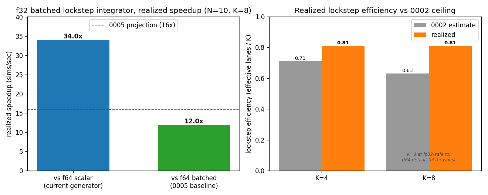

# 0007 — Per-architecture tuning: AVX2 / Zen 3, no AVX-512

- **Date / SHA / machine:** 2026-07-05 · `d756027` · AMD EPYC 7713 (Zen 3,
  2×64C, single core allocated to this run), L1d 32 KiB/core, L2 512 KiB/core,
  L3 32 MiB per 16-core CCX; GCC 13.3.0 (same compiler version as 0005/0006).
- **Hypothesis:** The batched force kernel and lockstep integrator (0003, 0005,
  0006) use Highway's **static dispatch**: every TU compiles for whatever
  `-march=native` resolves to on the *build* host
  (`include/coulomb/batched_force.hpp`), and 0001–0006 were all measured on an
  11th Gen Core i7-11800H (Tiger Lake, AVX-512 → K=8 f64 / K=16 f32). This
  machine is AVX2-only — **no AVX-512** — so the same source runs a narrower
  ISA target with zero code changes. Does the win survive, and how do the
  numbers move when K halves?

## Scope and framing

This is the "per-architecture tuning note" `docs/README.md` already reserves a
slot for under `benchmarks/`. It is not a design change: the code is already
portable by construction (0001's decision to keep the engine generic and gate
the SIMD path behind a separate `-march=native` target). The question is purely
empirical — re-run 0005 Part A and 0006 on a second, differently-shaped ISA and
see which conclusions are architecture-invariant and which were Tiger-Lake-
specific.

One fix was needed to do this cleanly: `python/analysis/plot_batched_integrator.py`
hardcoded the Tiger Lake lane counts (`K=8`/`K=16`) in its axis labels, plot
title, and the `CEILING_0002` lookup. On this host the batched kernels attain
`K=4` (f64) / `K=8` (f32), so the script would have mislabeled its own output
axis while silently plotting correct bar heights. Fixed to read `lanes` from
the CSV and extended `CEILING_0002` with 0002's `K=4` estimate (0.71) — the
script is now architecture-agnostic and needs no edits on the next host.

## Method

- Confirmed via Highway's own build-time target dump:
  `Current CPU supports: AVX2 SSE4 SSSE3 SSE2 EMU128 SCALAR` — no `AVX3`/
  `AVX3_ZEN4` (this binary was also compiled with those targets *attainable*
  but not selected, since static dispatch picks the best target the *build*
  host supports, and this EPYC generation doesn't have them). Cross-checked
  against `/proc/cpuinfo` flags (no `avx512*`).
- Same two harnesses as 0005 Part A and 0006, same commands, same rep counts,
  built under `relwithdebinfo`:

  ```bash
  cmake --preset relwithdebinfo && cmake --build --preset relwithdebinfo
  taskset -c 66 ./build/relwithdebinfo/bench/coulomb_force_batch \
      --benchmark_repetitions=15 --benchmark_report_aggregates_only=true \
      --benchmark_out=docs/benchmarks/0007-avx2-tuning.json \
      --benchmark_out_format=json
  taskset -c 66 ./build/relwithdebinfo/bench/coulomb_batched_integrator \
      --atoms 10 --batches 512 --reps 15 --csv docs/benchmarks/0007-avx2-tuning.csv
  python/analysis/.venv/bin/python python/analysis/plot_batched_integrator.py \
      --csv docs/benchmarks/0007-avx2-tuning.csv --out docs/benchmarks/0007-avx2-tuning.png
  ```

- `taskset -c 66` is a no-op here rather than a control: this sandbox's cgroup
  already restricts the process to a single logical CPU (core 66), unlike
  0005/0006's explicit single-core pin on an otherwise-idle 8C/16T laptop. This
  is a shared cluster node, not a dedicated idle machine — see Caveats.
- **Correctness gate** (integrator, runs before timing): batched vs. scalar
  `max |ΔP|/|P| = 2.7e-09` at rtol 1e-8 — tighter than 0006's 5.0e-09, both
  comfortably inside tolerance.
- Evidence: [`0007-avx2-tuning.json`](0007-avx2-tuning.json) (force kernel),
  [`0007-avx2-tuning.csv`](0007-avx2-tuning.csv) (integrator), and the figure
  below.

## Result

**Lane widths halve, exactly as expected.** AVX2's 256-bit registers give
`K=4` f64 / `K=8` f32, vs. Tiger Lake's AVX-512 512-bit `K=8`/`K=16`.

### Force kernel (0005 Part A equivalent)

Median real-time per call (ns) and throughput ratios (items/sec, so lane-count
differences are already normalized out):

| N  | scalar (ns) | batched f64 (ns) | batched f32 (ns) | **32/64** | 32/scalar | nodivsqrt 32/64 |
|----|-------------|------------------|------------------|-----------|-----------|------------------|
| 2  | 62.5        | 15.5             | 12.9             | 2.37      | 9.61      | 2.02             |
| 3  | 108.0       | 23.6             | 21.1             | 2.31      | 10.69     | 2.01             |
| 4  | 187.2       | 42.1             | 32.3             | 2.57      | 11.51     | 1.97             |
| 5  | 292.2       | 65.4             | 49.4             | 2.64      | 11.74     | 1.99             |
| 6  | 419.5       | 94.9             | 70.7             | 2.69      | 11.72     | 1.99             |
| 7  | 567.4       | 131.6            | 98.2             | 2.71      | 11.63     | 2.00             |
| 8  | 740.9       | 175.7            | 129.3            | 2.71      | 11.46     | 2.00             |
| 9  | 931.1       | 221.1            | 162.6            | 2.73      | 11.44     | 2.00             |
| 10 | 1153.1      | 272.4            | 200.0            | **2.73**  | 11.47     | 2.01             |

### Batched lockstep integrator (0006 equivalent)

N=10, pool 8192, 15 reps:

| run | K | sims/sec | cv | lockstep eff | mean batch steps |
|-----|---|----------|------|--------------|-------------------|
| scalar f64 default  | 1 | 3 209   | 1.0 %  | —     | 126.8 |
| scalar f64 prod     | 1 | 15 811  | 3.5 %  | —     | 25.5  |
| batched f64 default | 4 | 9 122   | 2.4 %  | 0.810 | 156.6 |
| batched f64 prod    | 4 | 50 176  | 6.2 %  | 0.875 | 29.2  |
| batched f32 default | 8 | 7 273   | 12.5 % | 0.307 | 413.6 |
| batched f32 prod    | 8 | **109 223** | 11.7 % | 0.810 | 31.5 |

Realized speedup of the f32 production path (K=8 here vs. K=16 on Tiger Lake):

| baseline | speedup (this host) | speedup (0006, Tiger Lake) |
|----------|---------------------|-----------------------------|
| f64 **batched** default (apples-to-apples) | 11.97× | 14.2× |
| f64 **scalar** default (the actual current generator) | **34.03×** | 27.4× |



## Conclusion

- **The pure-lane-doubling control is architecture-invariant.** `nodivsqrt
  32/64` sits at **2.00×–2.02×** across all N here, identical to Tiger Lake's
  exact 2.0×. This isolates the mechanism cleanly: doubling lane count for a
  divide/sqrt-free kernel buys exactly 2× regardless of ISA, confirming the
  control's claim generalizes rather than being a Tiger-Lake artifact.
- **f32's *excess* over pure lane-doubling is smaller here.** The real kernel's
  32/64 ratio tops out at **2.73× at N=10** (35% excess over the 2.00× floor),
  vs. Tiger Lake's **3.21×** (60% excess). Zen 3's `vdivpd`/`vsqrtpd` are
  proportionally less expensive relative to `vdivps`/`vsqrtps` than on Tiger
  Lake, so the divide/sqrt-bound headroom 0003 measured is real but
  smaller on this microarchitecture.
- **Lockstep efficiency is *higher* at the narrower lane counts this host is
  stuck with**, and lands above 0002's estimate at both operating points:
  `K=4` realized **0.810** vs. 0002's estimate 0.71 (cf. Tiger Lake `K=8`:
  realized 0.724 vs. estimate 0.63); `K=8` (f32 prod) realized **0.810** vs.
  0002's `K=8` estimate 0.63 (cf. Tiger Lake `K=16`: realized 0.751 vs. estimate
  0.57). This is 0002's model doing exactly what it predicted: fewer lanes in
  the batch means fewer stragglers diluting the shared-dt min-envelope.
- **The net realized win over the actual f64 scalar generator is *larger* on
  this narrower-SIMD host: 34.0× vs. Tiger Lake's 27.4×.** Half the peak lane
  count does not mean half the win — the efficiency gain from a smaller K more
  than offsets the smaller K itself. Peak lane count is not the whole story;
  the narrower host captures a larger fraction of what it has.
- **The apples-to-apples number (11.97× vs. f64 batched) undershoots 0006's
  14.2× and 0005's ~16× projection** — expected, because that projection was
  built from Tiger Lake's 3.21× force-kernel ratio. Composing this host's own
  measured multiplicands (2.73× force-kernel × ~5× step reduction) predicts
  ~13.7×, much closer to the realized 11.97× than reusing the other host's
  ratio would — **a 0005-style projection must be re-derived per architecture,
  not reused.**

## Caveats

- **Noisier than 0005/0006.** cv ranges 1.0–12.5% here vs. ≤2.4% there — this is
  a shared cluster allocation (single core carved out of a 128-thread node by
  the job's cgroup), not a dedicated idle laptop. The f32-default row (12.5%
  cv, the sub-ε thrash case) is the noisiest and least production-relevant; the
  two `prod` rows and the f64 default row (2.4–6.2%) are the ones that matter
  and are still an order of magnitude noisier than 0006's. Take absolute
  sims/sec here as more approximate than 0005/0006's numbers.
- **Absolute ns/sims-per-sec are not comparable across hosts** — different
  clock, microarchitecture, and core-allocation regime. Only the *ratios*
  computed within a single host (32/64, lockstep efficiency, speedup-vs-scalar)
  are safe to compare across the two reports; that comparison is what this
  report's conclusions rest on.
- **N=10 only**, same H-C-N-O chemistry as 0002/0004/0006 — this report holds N
  fixed and varies architecture, the complementary slice to 0006's still-open
  N sweep.
- **One non-AVX-512 data point.** Zen 3 specifically; Zen 4 (which does have
  AVX-512) and non-x86 ISAs (NEON, etc.) are unmeasured and could land
  anywhere in the tradeoff space this report and 0002 describe.

## Follow-ups

- Sample a third architecture with a distinct lane count (e.g. a Zen 4 host
  with AVX-512, or an ARM/NEON target) to see whether the "narrower K → higher
  lockstep efficiency" relationship is monotonic or Zen-3-specific.
- Fold the lane-count-vs-lockstep-efficiency tradeoff into 0002 as a standing
  table entry (it now has three confirmed points: K=4, K=8, K=16) rather than
  leaving it split across reports.
- Re-run once refill/wavefront (0002's named next step) lands — the efficiency
  gap this narrower host still has open (0.810 → 1.0) is smaller in absolute
  terms than Tiger Lake's, so the *relative* value of building refill may differ
  by architecture.
